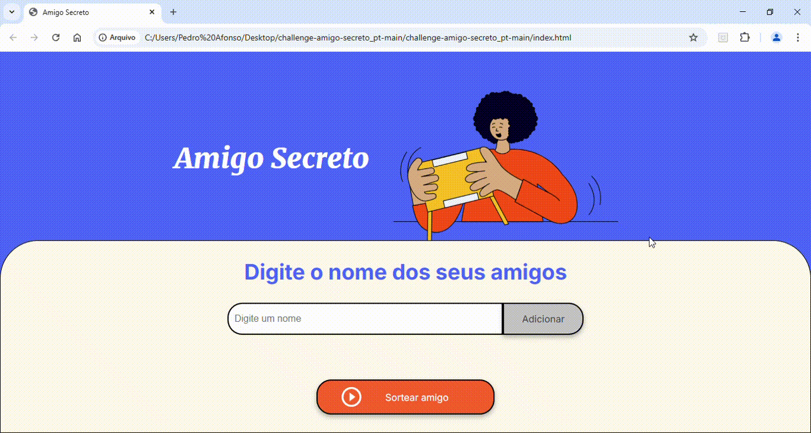

# 🎁 Desafio do Amigo Secreto  

Este projeto foi desenvolvido durante as aulas do **G8 ONE da Alura** e consiste em um jogo interativo onde os participantes adicionam nomes e realizam o sorteio para um **Amigo Secreto**.  

## 📌 Índice  

- [🎯 Objetivo](#-objetivo)  
- [🛠️ Tecnologias Utilizadas](#️-tecnologias-utilizadas)  
- [🚀 Funcionalidades](#-funcionalidades)  
- [📷 Demonstração](#-demonstração)  
- [📦 Como Executar o Projeto](#-como-executar-o-projeto)  
- [📜 Licença](#-licença)  

---

## 🎯 Objetivo  

O objetivo deste projeto é aplicar os conceitos de **JavaScript**, adquiridos durante as aulas, em um projeto prático e divertido, simulando um sorteio de **Amigo Secreto**.  

---

## 🛠️ Tecnologias Utilizadas  

Este projeto foi desenvolvido utilizando as seguintes tecnologias:  

- **HTML** → Estrutura da página  
- **CSS** → Estilização da interface  
- **JavaScript** → Lógica do sorteio e manipulação do DOM  

---

## 🚀 Funcionalidades  

- ✅ Adicionar nomes dos participantes  
- ✅ Sortear os amigos secretos de forma aleatória  
- ✅ Exibir os resultados do sorteio  
- ✅ Interface simples e intuitiva  

---

## 📷 Demonstração  



---

## 📦 Como Executar o Projeto  

1. **Clone o repositório:**  
   ```bash
   git@github.com:pedrohalarcao/Projeto-Amigo-Secreto.git

2. **Acesse a pasta do projeto:**
   challenge-amigo-secreto_pt-main

3. **Abra o arquivo:**
   index.html no navegador.


## 📜 Licença

Este projeto está sob a licença MIT. Consulte o arquivo LICENSE para mais detalhes.

   
